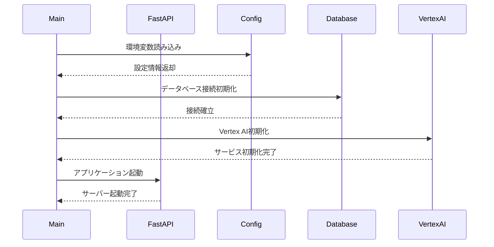
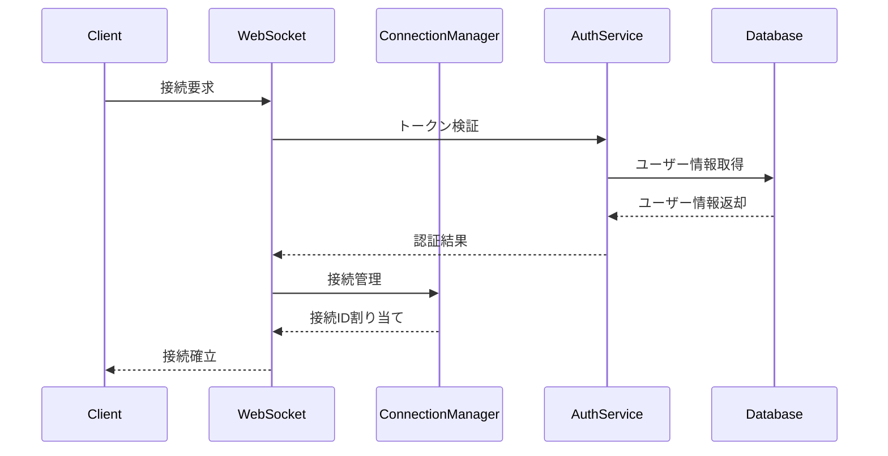
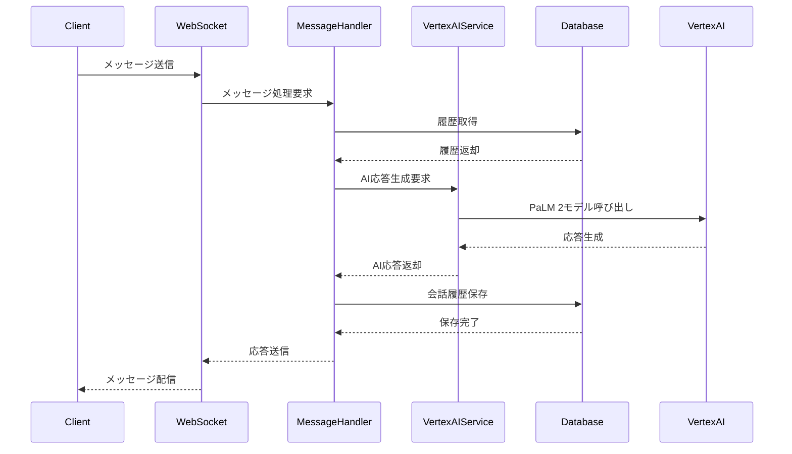
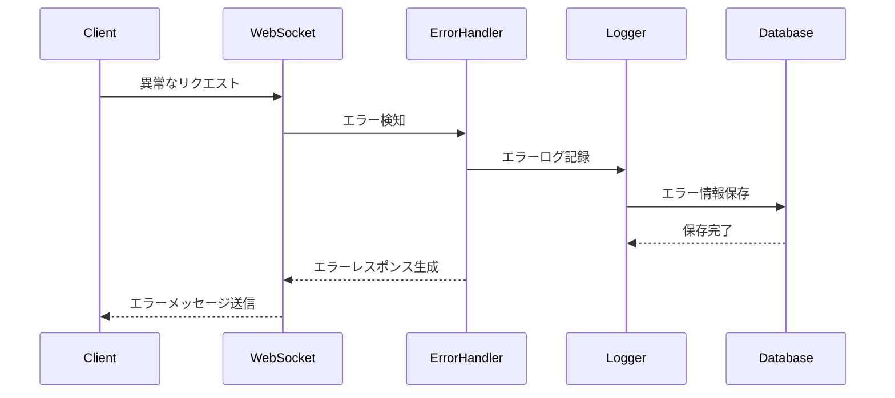
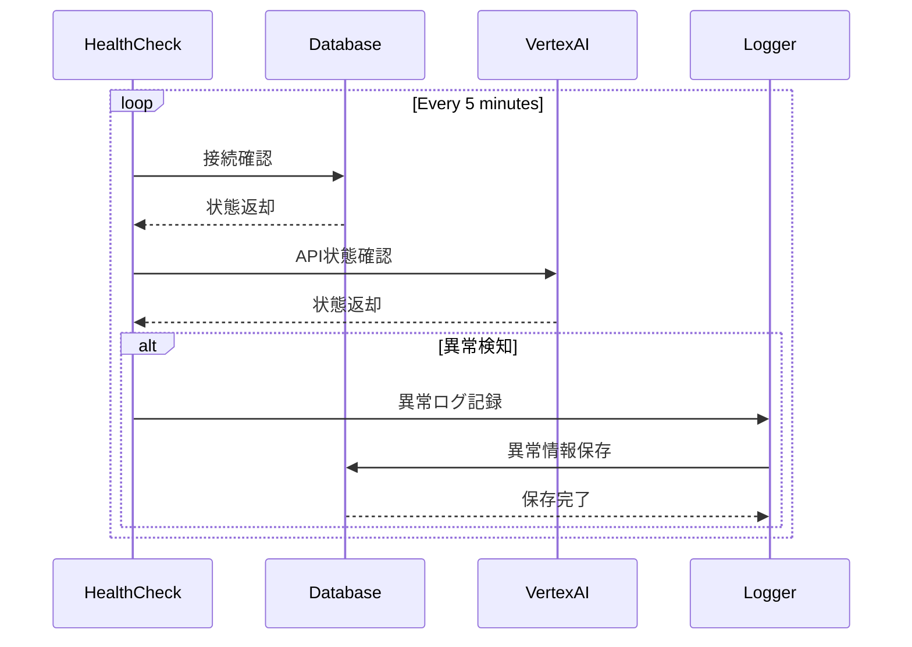
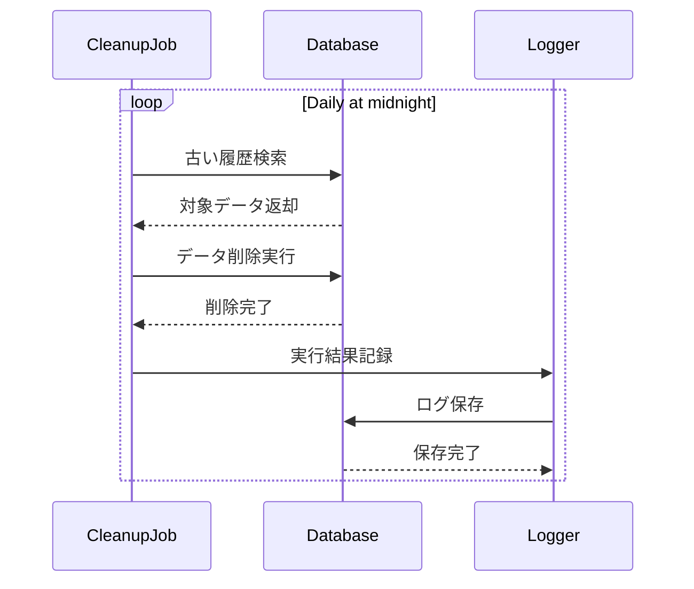

# バックエンドアプリケーション シーケンス図

## アプリケーション起動フロー

```mermaid
sequenceDiagram
    participant Main
    participant FastAPI
    participant Config
    participant Database
    participant VertexAI

    Main->>Config: 環境変数読み込み
    Config-->>Main: 設定情報返却
    Main->>Database: データベース接続初期化
    Database-->>Main: 接続確立
    Main->>VertexAI: Vertex AI初期化
    VertexAI-->>Main: サービス初期化完了
    Main->>FastAPI: アプリケーション起動
    FastAPI-->>Main: サーバー起動完了
```

## WebSocket接続フロー

```mermaid
sequenceDiagram
    participant Client
    participant WebSocket
    participant ConnectionManager
    participant AuthService
    participant Database

    Client->>WebSocket: 接続要求
    WebSocket->>AuthService: トークン検証
    AuthService->>Database: ユーザー情報取得
    Database-->>AuthService: ユーザー情報返却
    AuthService-->>WebSocket: 認証結果
    WebSocket->>ConnectionManager: 接続管理
    ConnectionManager-->>WebSocket: 接続ID割り当て
    WebSocket-->>Client: 接続確立
```

## チャットメッセージ処理フロー

```mermaid
sequenceDiagram
    participant Client
    participant WebSocket
    participant MessageHandler
    participant VertexAIService
    participant Database

    Client->>WebSocket: メッセージ送信
    WebSocket->>MessageHandler: メッセージ処理要求
    MessageHandler->>Database: 履歴取得
    Database-->>MessageHandler: 履歴返却
    MessageHandler->>VertexAIService: AI応答生成要求
    VertexAIService->>VertexAI: PaLM 2モデル呼び出し
    VertexAI-->>VertexAIService: 応答生成
    VertexAIService-->>MessageHandler: AI応答返却
    MessageHandler->>Database: 会話履歴保存
    Database-->>MessageHandler: 保存完了
    MessageHandler-->>WebSocket: 応答送信
    WebSocket-->>Client: メッセージ配信
```

## エラーハンドリングフロー

```mermaid
sequenceDiagram
    participant Client
    participant WebSocket
    participant ErrorHandler
    participant Logger
    participant Database

    Client->>WebSocket: 異常なリクエスト
    WebSocket->>ErrorHandler: エラー検知
    ErrorHandler->>Logger: エラーログ記録
    Logger->>Database: エラー情報保存
    Database-->>Logger: 保存完了
    ErrorHandler-->>WebSocket: エラーレスポンス生成
    WebSocket-->>Client: エラーメッセージ送信
```

## 定期的なヘルスチェックフロー

```mermaid
sequenceDiagram
    participant HealthCheck
    participant Database
    participant VertexAI
    participant Logger

    loop Every 5 minutes
        HealthCheck->>Database: 接続確認
        Database-->>HealthCheck: 状態返却
        HealthCheck->>VertexAI: API状態確認
        VertexAI-->>HealthCheck: 状態返却
        
        alt 異常検知
            HealthCheck->>Logger: 異常ログ記録
            Logger->>Database: 異常情報保存
            Database-->>Logger: 保存完了
        end
    end
```

## バッチ処理フロー（履歴クリーンアップ）

```mermaid
sequenceDiagram
    participant CleanupJob
    participant Database
    participant Logger

    loop Daily at midnight
        CleanupJob->>Database: 古い履歴検索
        Database-->>CleanupJob: 対象データ返却
        CleanupJob->>Database: データ削除実行
        Database-->>CleanupJob: 削除完了
        CleanupJob->>Logger: 実行結果記録
        Logger->>Database: ログ保存
        Database-->>Logger: 保存完了
    end
``` 